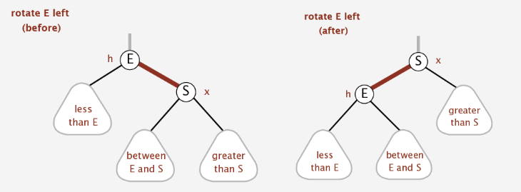
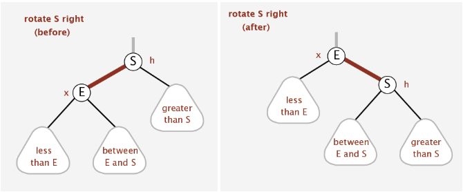
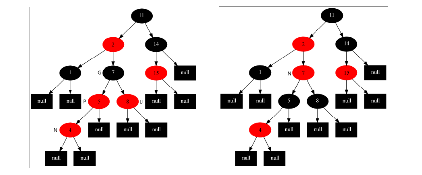
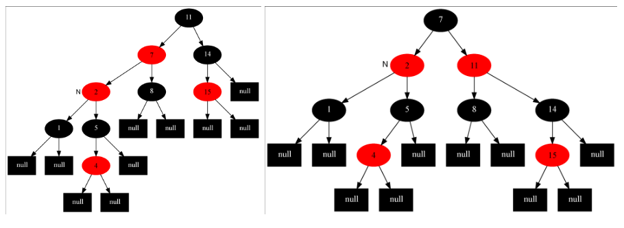

# RedBlackTree

## 概念(加粗部分为决定平衡的关键性质)

> 1. 节点是红色或黑色。
> 2. 根是黑色。
> 3. 所有叶子都是黑色（叶子是NIL节点）。
> 4. **每个红色节点必须有两个黑色的子节点。（从每个叶子到根的所有路径上不能有两个连续的红色节点。）**
> 5. **从任一节点到其每个叶子的所有[简单路径](https://zh.wikipedia.org/wiki/%E9%81%93%E8%B7%AF_(%E5%9B%BE%E8%AE%BA))都包含相同数目的黑色节点**

## 左旋

> 1. 把当前节点的右子节点上移到当前位置
>
> 2. 把右子节点的左子节点,赋给当前节点的右子节点
>
>    如图
>
>    

## 右旋

> 1. 把当前节点的左子节点上移到当前位置
>
> 2. 把当前节点的左子节点的指针,指向左子节点的右子节点
>
>    如图
>
>    

## 插入

 插入的节点一定是红色,因为如果插入节点是黑色,必违背性质5,而是红色的话,只有一半的概率违背4

> 1. 先用二叉搜索树找到插入位置
> 2. 插入后做fixup

## 插入fixup

插入后需要对树做fixup

> 1. 如果是根节点,把红色涂黑
>
> 2. 如果父节点是黑色,则正常返回
>
> 3. 如果父节点和叔叔节点都是红色,则把父节点,叔叔节点涂黑,这样祖父节点就变成了情况4,fixup祖父节点
>
>    如图,N是fixup的节点
>
>    
>
> 4. 如果父节点是红色,叔叔节点是黑色,且插入节点是父节点的右子节点,此时,以父节点的父节点,即祖父节点为基点,左旋,
>
>    如图,基础状态参考图[parent_uncle_red]的右图,转换后状态见下左图
>
>    
>
> 5. 如果父节点是红色,叔叔节点是黑色,且插入节点是父节点的左子节点,如上图右,此时fixup节点为N(2),此时,先把父节点涂黑,祖父节点涂红,然后以祖父节点为基点右旋

## 删除(二叉搜索树)

> 1. 叶子节点,直接删就ok了
> 2. 只有一个儿子节点,把儿子节点交给父节点就ok了
> 3. 有两个儿子节点, 选择左儿子的最大的儿子,或者右儿子的最小的儿子,交给父节点

## 删除(红黑树)

> 1. 跟二叉搜索树一样, 找到这个节点, 先找到可以替换的子节点,即二叉搜索树的删除3,**所以最终替换的是只可能有一个或0个子节点的节点**
>
> 2. 替换节点的值跟当前要删除的节点的值替换,删除替换节点
>
> 3. 如果该替换节点是根,且没有子节点,删除
>
> 4. 如果该替换节点是根,有一个子节点,把子节点替换上来,涂黑,结束
>
> 5. 把N的子节点替换到N的父节点的子节点,然后判断一些性质
>
>    > 1. 如果要删除的是黑色,被替换上来的节点为红色,把新的当前位置的节点涂黑,结束
>    > 2. 如果被替换上来的节点也为黑色,即没有子节点,此时删除黑节点会违背性质5,具体见fixup

## 删除fixup(P:删除节点的父节点,N:替换删除节点的子节点,D:删除节点,B:D的兄弟节点) 此时D一定为黑色,因为删除红色不需要fixup

> 1. 如果D是黑色,N是红色,N替换D,把N涂黑,结束/反之亦然
> 2. 如果N为null,B为红色,把P变为红色,B变为黑色,如果D是左子节点,左旋B,否则右旋B
> 3. 如果P是黑色,B是黑色(这里黑色的原因,可能是执行2之后的),B的子节点全是黑色,把B涂红,递归fixup P
> 4. 如果P是红色,B是黑色,B的子节点全是黑色,把B涂红,P涂黑
> 5. 