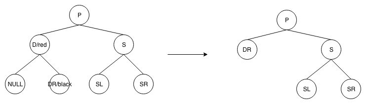
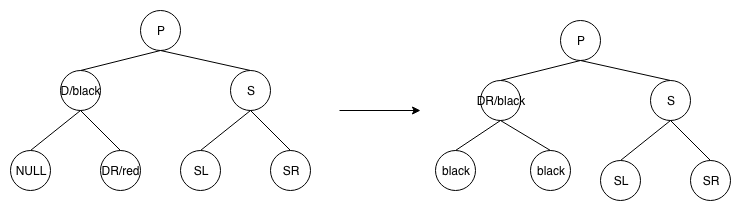
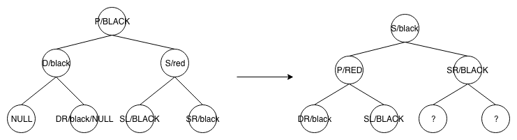
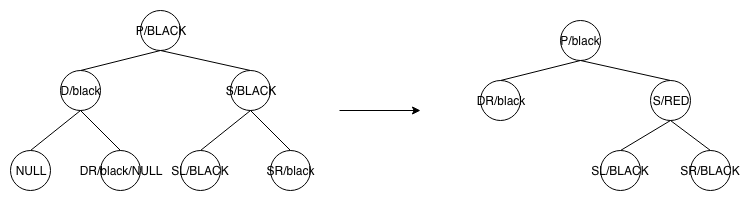
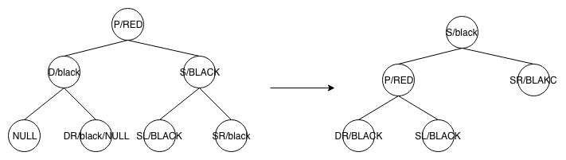
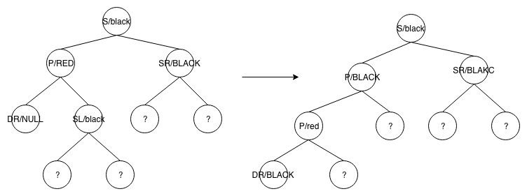
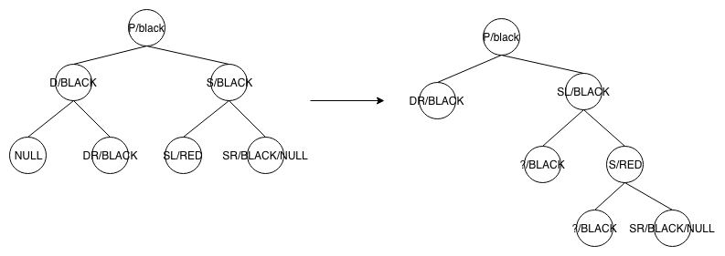
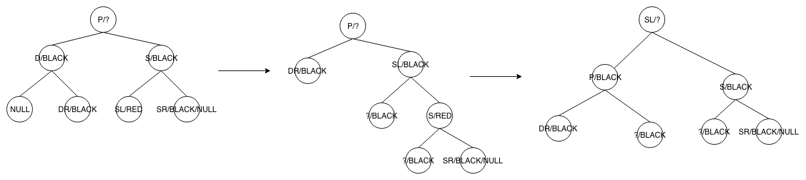

# RedBlackTree

## 概念(加粗部分为决定平衡的关键性质)

> 1. 节点是红色或黑色。
> 2. 根是黑色。
> 3. 所有叶子都是黑色（叶子是NIL节点）。
> 4. **每个红色节点必须有两个黑色的子节点。（从每个叶子到根的所有路径上不能有两个连续的红色节点。）**
> 5. **从任一节点到其每个叶子的所有[简单路径](https://zh.wikipedia.org/wiki/%E9%81%93%E8%B7%AF_(%E5%9B%BE%E8%AE%BA))都包含相同数目的黑色节点**

## 左旋

> 1. 把当前节点的右子节点上移到当前位置
>
> 2. 把右子节点的左子节点,赋给当前节点的右子节点
>
>    如图
>
>    

## 右旋

> 1. 把当前节点的左子节点上移到当前位置
>
> 2. 把当前节点的左子节点的指针,指向左子节点的右子节点
>
>    如图
>
>    

## 插入

 插入的节点一定是红色,因为如果插入节点是黑色,必违背性质5,而是红色的话,只有一半的概率违背4

> 1. 先用二叉搜索树找到插入位置
> 2. 插入后做fixup

## 插入fixup

插入后需要对树做fixup

> 1. 如果是根节点,把红色涂黑
>
> 2. 如果父节点是黑色,则正常返回
>
> 3. 如果父节点和叔叔节点都是红色,则把父节点,叔叔节点涂黑,这样祖父节点就变成了情况4,fixup祖父节点
>
>    如图,N是fixup的节点
>
>    
>
> 4. 如果父节点是红色,叔叔节点是黑色,且插入节点是父节点的右子节点,此时,以父节点的父节点,即祖父节点为基点,左旋,
>
>    如图,基础状态参考图[parent_uncle_red]的右图,转换后状态见下左图
>
>    
>
> 5. 如果父节点是红色,叔叔节点是黑色,且插入节点是父节点的左子节点,如上图右,此时fixup节点为N(2),此时,先把父节点涂黑,祖父节点涂红,然后以祖父节点为基点右旋

## 删除(二叉搜索树)

> 1. 叶子节点,直接删就ok了
> 2. 只有一个儿子节点,把儿子节点交给父节点就ok了
> 3. 有两个儿子节点, 选择左儿子的最大的儿子,或者右儿子的最小的儿子,交给父节点

## 删除(红黑树)

> 1. 跟二叉搜索树一样, 找到这个节点, 先找到可以替换的子节点,即二叉搜索树的删除3,**如果固定选择找右子树的最左的儿子,所以最终替换的是只可能有一个右子节点或0个子节点的节点**
>
> 2. 替换节点的值跟当前要删除的节点的值替换,删除替换节点
>
> 3. 如果该替换节点是根,且没有子节点,删除
>
> 4. 如果该替换节点是根,有一个子节点,把子节点替换上来,涂黑,结束
>
> 5. 把N的子节点替换到N的父节点的子节点,然后判断一些性质
>
>    > 1. 如果要删除的是黑色,被替换上来的节点为红色,把新的当前位置的节点涂黑,结束
>    > 2. 如果被替换上来的节点也为黑色,即没有子节点,此时删除黑节点会违背性质5,具体见fixup

## 删除fixup(P:删除节点的父节点,DR:替换删除节点的子节点,D:删除节点,S:D的兄弟节点) 此时D一定为黑色,因为删除红色不需要fixup

> 1. 如果D是红色,DR是黑色,DR替换D
>
>    
>
> 2. 如果D是黑色,DR是红色,DR替换D, 把DR涂黑
>
>    
>
> 3. 如果D为黑色,DR为黑色(NULL)
>
>    1. 如果S为红色,则P肯定为黑色(性质4),如果SL,SR,都是黑色,此时SL,SR都是double black(即本身不是null,且是黑色,且有且仅有一个子节点黑色),此时需要把P涂红,S涂黑,以S左旋/右旋,**此时没有结束,因为SL是double black, 左边路径的black少一个,后续过程参考3-3,3-4,3-5**
>
>       
>
>    2. P, S, SL,SR均为黑色,此时SL, SR一定为null,此时把S涂红即可,**此时p这个路径看上去已经平衡了,但是经过p的黑色节点数其实少了一个,所以要递归调整P**
>
>       
>
>    3. P是红色,S,SL,SR是黑色,左旋/右旋S,
>
>       
>
>       如上图3-1,再经过3-3的规则转换后,变为下图
>
>       
>
>    4. 如果P为黑色/红色,S为黑色,如果SL是红色,SR是黑色,且D是左儿子,此时需要把SL涂黑,S涂红,右旋S,如下图,**此时也没有结束, 需要继续走下去,在3-5继续变换**
>
>       
>
>    5. 如果P是黑色/红色,S,SL是黑色黑色,SR是红色,此时把SR涂黑,左旋S,并交换S和P的颜色
>
>       
>
> 4. 综上,讨论了以下几种情况
>
>    1. D和DR一红一黑
>    2. D为黑色,DR为黑色(必为NULL,否则从D上的路径违背性质5),此时主要看兄弟节点的颜色,因为左边路径少了一个黑色
>       1. S为红色,P一定为黑色,SL,SR都为double black(即本身不是null,且是黑色,且有且仅有一个子节点黑色)
>       2. S为黑色,如果P为黑色,如果SL,SR都是黑色的NULL,涂红S,递归P(此时P的路径少一个黑色)
>       3. S为黑色,P为红色,如果SL,SR都是黑色NULL,左旋S,
>       4. S为黑色,P颜色不定,SL为红色,SR为黑色,右旋S,SL涂黑,S涂红,此时D那一路依然缺少黑色节点,左旋新的S,交换S和P的颜色
>       5. S为黑色,P颜色不定,SL为黑色,SR为红色,SR涂黑,左旋S,交换S和P的颜色
>       6. S为黑色,P颜色不定,SL,SR都为红色,参考5处理