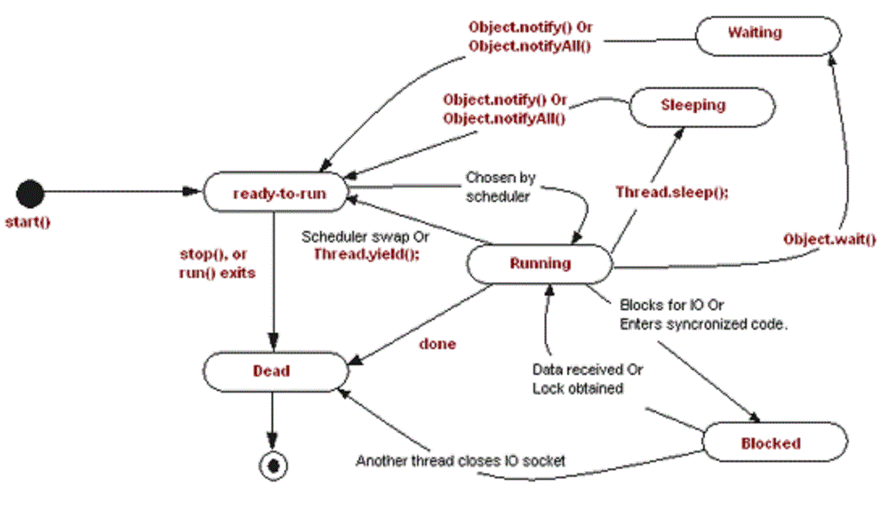

# wait sleep yield

先看一张状态转换图



## wait

[参考Object.wait](Object.wait.md)

> 1. 会释放锁

## sleep

```c++
//jvm.cpp
JVM_ENTRY(void, JVM_Sleep(JNIEnv* env, jclass threadClass, jlong millis))
  JVMWrapper("JVM_Sleep");

  if (millis < 0) {
    THROW_MSG(vmSymbols::java_lang_IllegalArgumentException(), "timeout value is negative");
  }

  if (Thread::is_interrupted (THREAD, true) && !HAS_PENDING_EXCEPTION) {
    THROW_MSG(vmSymbols::java_lang_InterruptedException(), "sleep interrupted");
  }

  // Save current thread state and restore it at the end of this block.
  // And set new thread state to SLEEPING.
  JavaThreadSleepState jtss(thread);

#ifndef USDT2
  HS_DTRACE_PROBE1(hotspot, thread__sleep__begin, millis);
#else /* USDT2 */
  HOTSPOT_THREAD_SLEEP_BEGIN(
                             millis);
#endif /* USDT2 */

  EventThreadSleep event;

  if (millis == 0) {
    // When ConvertSleepToYield is on, this matches the classic VM implementation of
    // JVM_Sleep. Critical for similar threading behaviour (Win32)
    // It appears that in certain GUI contexts, it may be beneficial to do a short sleep
    // for SOLARIS
    if (ConvertSleepToYield) {
      os::yield();
    } else {
      ThreadState old_state = thread->osthread()->get_state();
      thread->osthread()->set_state(SLEEPING);
      os::sleep(thread, MinSleepInterval, false);
      thread->osthread()->set_state(old_state);
    }
  } else {
    ThreadState old_state = thread->osthread()->get_state();
    thread->osthread()->set_state(SLEEPING);
    if (os::sleep(thread, millis, true) == OS_INTRPT) {
      // An asynchronous exception (e.g., ThreadDeathException) could have been thrown on
      // us while we were sleeping. We do not overwrite those.
      if (!HAS_PENDING_EXCEPTION) {
        if (event.should_commit()) {
          event.set_time(millis);
          event.commit();
        }
#ifndef USDT2
        HS_DTRACE_PROBE1(hotspot, thread__sleep__end,1);
#else /* USDT2 */
        HOTSPOT_THREAD_SLEEP_END(
                                 1);
#endif /* USDT2 */
        // TODO-FIXME: THROW_MSG returns which means we will not call set_state()
        // to properly restore the thread state.  That's likely wrong.
        THROW_MSG(vmSymbols::java_lang_InterruptedException(), "sleep interrupted");
      }
    }
    thread->osthread()->set_state(old_state);
  }
  if (event.should_commit()) {
    event.set_time(millis);
    event.commit();
  }
#ifndef USDT2
  HS_DTRACE_PROBE1(hotspot, thread__sleep__end,0);
#else /* USDT2 */
  HOTSPOT_THREAD_SLEEP_END(
                           0);
#endif /* USDT2 */
JVM_END
```

> 1. 判断时间millis是否为0
>    1. 如果为0，且需要转化为yield，则调用os::yield
>    2. 否则设置thread state为sleeping,调用os::sleep,这个sleep的时间为MinSleepInterval;
> 2. 时间millis不是0，设置thread state为sleeping，调用os::sleep,时间为入参的millis
> 3. 如果sleep结束，返回值是OS_INTRPT，如果没有其他异常，则抛出java_lang_InterruptedException
> 4. 将线程状态复原

```c++
//os_linux.cpp os::sleep
int os::sleep(Thread* thread, jlong millis, bool interruptible) {
  assert(thread == Thread::current(),  "thread consistency check");

  ParkEvent * const slp = thread->_SleepEvent ;
  slp->reset() ;
  OrderAccess::fence() ;

  if (interruptible) {
    jlong prevtime = javaTimeNanos();

    for (;;) {
      if (os::is_interrupted(thread, true)) {
        return OS_INTRPT;
      }

      jlong newtime = javaTimeNanos();

      if (newtime - prevtime < 0) {
        // time moving backwards, should only happen if no monotonic clock
        // not a guarantee() because JVM should not abort on kernel/glibc bugs
        assert(!Linux::supports_monotonic_clock(), "time moving backwards");
      } else {
        millis -= (newtime - prevtime) / NANOSECS_PER_MILLISEC;
      }

      if(millis <= 0) {
        return OS_OK;
      }

      prevtime = newtime;

      {
        assert(thread->is_Java_thread(), "sanity check");
        JavaThread *jt = (JavaThread *) thread;
        ThreadBlockInVM tbivm(jt);
        OSThreadWaitState osts(jt->osthread(), false /* not Object.wait() */);

        jt->set_suspend_equivalent();
        // cleared by handle_special_suspend_equivalent_condition() or
        // java_suspend_self() via check_and_wait_while_suspended()

        slp->park(millis);

        // were we externally suspended while we were waiting?
        jt->check_and_wait_while_suspended();
      }
    }
  } else {
    OSThreadWaitState osts(thread->osthread(), false /* not Object.wait() */);
    jlong prevtime = javaTimeNanos();

    for (;;) {
      // It'd be nice to avoid the back-to-back javaTimeNanos() calls on
      // the 1st iteration ...
      jlong newtime = javaTimeNanos();

      if (newtime - prevtime < 0) {
        // time moving backwards, should only happen if no monotonic clock
        // not a guarantee() because JVM should not abort on kernel/glibc bugs
        assert(!Linux::supports_monotonic_clock(), "time moving backwards");
      } else {
        millis -= (newtime - prevtime) / NANOSECS_PER_MILLISEC;
      }

      if(millis <= 0) break ;

      prevtime = newtime;
      slp->park(millis);
    }
    return OS_OK ;
  }
}
```

> 1. 取出thread的_SleepEvent，重置，设置fence
> 2. 如果可以被打断(interruptible)
>    1. 循环，如果被打断了就返回OS_INTRPT
>    2. millis休眠的时间，需要减去循环的时间，如果时间结束了，返回OS_OK
>    3. 否则 调用_SleepEvent.park
> 3. 如果不能被打断，就直接park

## yield

```c++
//os_linux.cpp os::yield
void os::yield() {
  sched_yield();
}
```

> 1. 直接调用sched_yield

## 网上的一些摘抄

```
Thread.sleep()方法用来暂停线程的执行，将CPU放给线程调度器。
Thread.sleep()方法是一个静态方法，它暂停的是当前执行的线程。
Java有两种sleep方法，一个只有一个毫秒参数，另一个有毫秒和纳秒两个参数。
与wait方法不同，sleep方法不会释放锁
如果其他的线程中断了一个休眠的线程，sleep方法会抛出Interrupted Exception。
休眠的线程在唤醒之后不保证能获取到CPU，它会先进入就绪态，与其他线程竞争CPU。
有一个易错的地方，当调用t.sleep()的时候，会暂停线程t。这是不对的，因为Thread.sleep是一个静态方法，它会使当前线程而不是线程t进入休眠状态。
```

